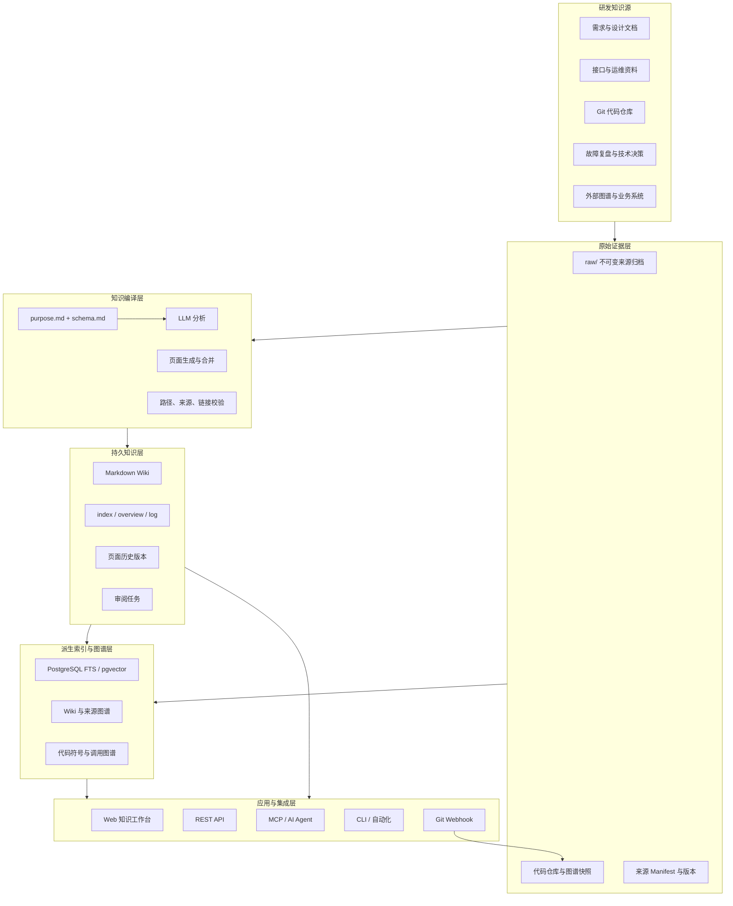
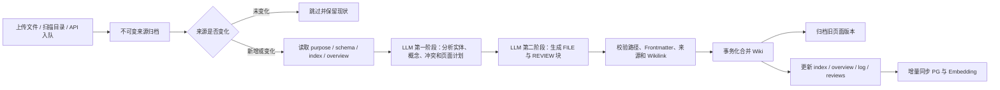
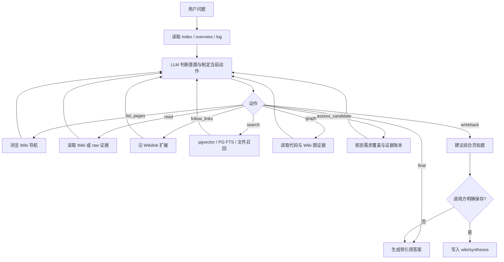
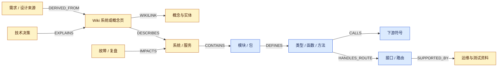
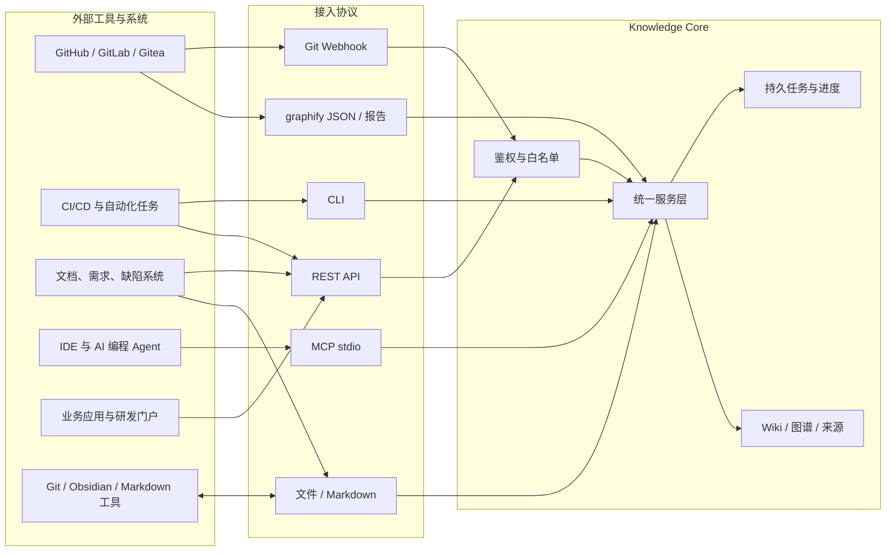

# 研发知识库：建设方法、系统功能与接口对接

> 面向管理者、研发负责人、架构师和平台团队的系统说明 

## Executive Summary｜执行摘要

- **研发知识库不是“把文档放进向量库”，而是持续维护研发事实的知识基础设施。** 它把需求、设计、代码、接口、故障和决策编译为可阅读、可追溯、可演进的 Wiki，并用知识图谱连接“为什么这样设计、由谁实现、改动会影响什么”。
- **系统的核心产物是持久知识，不是一次性回答。** 原始资料和代码快照保留为证据，LLM 负责分析、组织、综合和审阅；Markdown Wiki 是可由人、Git、Obsidian 和 Agent 共同使用的知识产品，PostgreSQL 只承担可重建的检索、图谱和运行状态。
- **系统同时服务人和工具。** 研发人员通过 Web 搜索、提问、浏览代码与图谱；管理员通过后台导入、审阅和治理；其他研发系统通过 REST API、Git Webhook、CLI 和 MCP 接入同一套核心能力。
- **建议按“资料接入—知识编译—代码图谱—证据查询—持续治理—工具链集成”六个步骤建设。** 先打通一个关键仓库和一组核心研发文档，再逐步扩展到跨仓库、需求缺陷、CI/CD 和 AI 编程场景。

---

## 1. 系统定位：建设研发知识的“长期记忆”和“关系网络”

研发知识通常散落在代码仓库、需求平台、设计文档、接口文档、故障记录、聊天记录和个人经验中。普通全文检索只能找到文件，普通 RAG 通常只能从若干片段临时生成回答，二者都难以长期维护以下事实：

- 某个系统为什么这样设计，设计决策来自哪些资料；
- 某个接口由哪个服务、路由、方法和下游依赖实现；
- 某项需求影响哪些模块、调用链、数据结构和测试范围；
- 当前文档是否仍与代码、版本和运行事实一致；
- 一次高质量排查或分析能否沉淀为后续可复用的知识。

研发知识库的目标是把这些分散信息转化为一个持续演进的研发 Wiki，并用 GitNexus 风格的精确代码事实和 graphify 风格的跨资料图谱补足纯文档知识的盲区。

### 1.1 与普通 RAG 的关键区别

| 维度 | 普通 RAG | 研发知识库目标形态 |
| --- | --- | --- |
| 知识产物 | 查询时临时拼接片段 | 持久、可编辑、可版本化的 Wiki |
| 知识组织 | Chunk 和向量相似度 | 来源、概念、实体、系统、模块、接口、流程和综合页 |
| 代码理解 | 代码文本搜索或摘要 | 符号、调用、导入、实现、路由和流程等精确图事实 |
| 查询控制 | 搜索结果直接进入回答 | LLM 规划读取、搜索、图谱和证据核验动作 |
| 可追溯性 | 依赖检索片段 | 原始来源、Wiki 页面、页面历史、代码仓库和 commit |
| 持续维护 | 重新切片、重新索引 | 增量编译、矛盾审阅、知识缺口和版本保留 |
| 人机协作 | 用户消费答案 | 人负责方向与判断，LLM 负责维护与综合 |

**管理含义：** 建设重点不应只是选一个向量数据库，而应围绕“知识如何形成、如何更新、如何证明、如何被复用”设计完整闭环。

---

## 2. 建设方法：六层架构形成完整闭环

研发知识库应由六个相互解耦的层次组成。每一层都有明确的职责和事实边界，避免 LLM 输出、数据库索引和原始资料互相替代。

项目需求（目前仅仅考虑作为开发中提案设计与开发设计的回溯参考），知识库导入 提案，spce task design等以文件上传，连接跟提案一起进入知识库，将来引入到项目管理需求模块，触发提交知识库时机：归档

开发流程 提案中带需求编号-》提案。。。——》归档 提交到知识库，

Git 代码仓库优先级低，未来可以在复杂系统，基础平台

以下可以在claudecode中交互使用

故障 现在比较少，可以作为入库一部分，以后开发故障管理系统对接，暂时从wps文档导入

精选技术文章（需要），

业务资料 （暂时不用）

高频提示词（原始对话积累，分类，提炼 ->原始对话，模型改进， 区分正式和非正式，区分负面，正面） 正面且正式 可以在claude code中引用使用，页面可以有原始和改进提示词展示，状态，以及正负面的修改

每天总结 “增量、矛盾审阅、知识缺口和版本保留，人负责方向与判断，LLM 负责维护与综合”

项目知识库，个人知识库，个人知识库总结，项目知识可以添加项目负责人进行审核归纳。个人知识库可以引用项目知识库。 个人知识库自己维护，LLM进行分类总结，个人经验和踩坑

能查看文章、编辑文章、上传文章（批量）

外部知识库（分类）

先做网页（搜索 top K）

### 2.1 总体架构

下图展示研发知识从外部工具进入系统，到形成 Wiki、图谱和应用能力的完整路径。

这套架构的关键不是层数，而是事实边界：`raw/` 保存不可变证据，`wiki/` 保存持续演进的知识产品，`.kbcore/` 保存可恢复的运行状态，PostgreSQL 保存可重建的索引，LLM 不单独成为事实来源。

### 2.2 六层分别怎么做

| 层次 | 建设内容 | 关键产物 | 核心要求 |
| --- | --- | --- | --- |
| 知识源层 | 确定需求、设计、代码、接口、运维、故障和决策来源 | 来源目录与接入规则 | 先选高价值来源，不追求一次覆盖全部系统 |
| 原始证据层 | 归档原文件、提取文本、记录哈希和版本 | `raw/`、来源 metadata、manifest | 原始来源不可静默覆盖，逻辑来源变更保留历史版本 |
| 知识编译层 | 读取项目目标和结构规则，先分析再生成 | 分析结果、页面计划、审阅项 | 生成内容必须校验路径、元数据、来源和 Wikilink |
| 持久知识层 | 建设来源、概念、实体、代码和综合页面 | Markdown Wiki、导航页、历史版本 | 页面既要适合人读，也要适合 Agent 导航和 Git 审阅 |
| 索引图谱层 | 建设全文、向量、Wiki 关系和代码关系 | PG 索引、图节点、图边、社区和流程 | 精确代码事实优先于 LLM 推断关系 |
| 应用集成层 | 提供 Web、API、Webhook、CLI、MCP | 查询、审阅、任务和集成接口 | 所有入口复用同一核心逻辑，不形成新的知识源 |

---

## 3. 知识模型：把“研发资料”组织成可导航的研发事实

研发知识库不能只有“文档”这一种对象。建议围绕下面的知识类型组织 Wiki 和图谱。

| 知识类型 | 典型内容 | 主要来源 | 典型关系 |
| --- | --- | --- | --- |
| 来源 Source | 一份需求、设计、复盘或规范的摘要 | 原始文件 | `DERIVED_FROM`、`SUPERSEDES` |
| 系统 System | 产品系统、平台或业务域 | 架构文档、代码仓库 | `CONTAINS`、`DEPENDS_ON` |
| 模块 Module | 服务、包、组件或功能域 | 代码、设计文档 | `CONTAINS`、`IMPORTS` |
| 接口 Interface | HTTP API、消息、工具或协议 | OpenAPI、路由、代码 | `HANDLES_ROUTE`、`CALLS` |
| 符号 Symbol | 类型、接口、函数、方法、常量 | 代码 AST/语义图 | `DEFINES`、`CALLS`、`IMPLEMENTS` |
| 流程 Process | 登录、发布、支付、摄取、查询等执行流程 | 调用图、流程文档 | `STARTS_AT`、`FLOWS_TO` |
| 概念 Concept | 业务术语、技术机制、设计原则 | 多份来源综合 | `RELATES_TO`、`MENTIONS` |
| 实体 Entity | 团队、产品、协议、模型、数据对象 | 文档、代码 | `OWNS`、`USES`、`PRODUCES` |
| 决策 Decision | ADR、技术选型、约束和原因 | ADR、评审记录 | `DECIDES`、`AFFECTS` |
| 事件 Incident | 故障、问题、根因、处置和改进 | 复盘、工单、日志摘要 | `IMPACTS`、`CAUSED_BY` |
| 综合 Synthesis | 跨来源形成的结论、方案和说明 | 证据化查询 | `CITES`、`SUMMARIZES` |
| 审阅 Review | 矛盾、缺页、陈旧声明和待判断问题 | 编译与语义检查 | `AFFECTS`、`RESOLVED_BY` |

当前实现已经稳定支持来源、概念、实体、代码、综合和审阅等 Wiki 页面，以及仓库、目录、文件、包、类型、函数、方法、路由、工具、社区和流程等代码图节点。决策、事件和外部工单等类型可按相同模型继续扩展。

---

## 4. 知识生产：从资料和代码形成持久 Wiki

**知识生产不是把文件切块后立即生成答案，而是一次受控的“知识编译”。** 一份来源可以更新多个长期页面，同时保留来源摘要和旧页面版本。

### 4.1 文档摄取与编译流程

这个流程解决三个风险：未变化资料反复消耗模型成本、LLM 输出破坏现有知识、写入中断造成半成品。Knowledge Core 当前已经实现来源哈希、可恢复队列、项目级写锁、事务日志、页面版本归档和增量同步等保护机制。

### 4.2 代码仓库知识生产

代码知识分为两类：

- **精确事实**：通过 Go 原生索引或 GitNexus/graphify 兼容图谱获得文件、符号、调用、导入、实现、路由和流程关系；
- **解释性知识**：LLM 在精确事实之上生成仓库概览、模块说明、社区解释和建议问题。

系统必须遵守“精确事实优先”原则：LLM 可以解释一条调用链，但不能用自由文本覆盖真实的符号、调用或 commit 事实。

### 4.3 增量更新与历史保护

- 来源内容通过 SHA256 判断是否变化；
- 同一逻辑来源的新内容形成新的不可变版本；
- 当前来源摘要代表最新版本，共享页面保留累计来源；
- 页面覆盖前将旧内容归档到 `.kbcore/page-versions/`；
- 来源 manifest 记录来源哈希、生成页面、版本和页面所有权；
- PostgreSQL 可以从 Markdown、manifest、页面版本和图谱快照重建。

---

## 5. 系统功能：围绕研发工作的完整能力地图

### 5.1 研发资料统一接入

**解决问题：** 研发资料格式、目录和来源分散，新增资料无法稳定进入知识库。

主要功能：

- Web 上传文件和文件夹，支持 Markdown、文本、PDF、DOCX 等来源；
- 扫描 `raw/sources/`，识别新增、变更、删除和不支持的文件；
- 通过 API 或 CLI 将外部文件加入持久摄取队列；
- 记录队列状态、重试次数、失败原因和生成页面；
- 来源删除先执行 dry-run，展示受影响页面和清理范围；
- 旧来源目录可预览并迁移到每来源独立归档结构。

**产物：** 不可变来源归档、来源 manifest、来源摘要页、摄取任务记录。

### 5.2 LLM Wiki 自动编译

**解决问题：** 人工整理文档成本高，普通自动摘要又无法形成可维护的知识网络。

主要功能：

- 分析来源中的关键实体、概念、论点、冲突和页面更新建议；
- 创建或更新来源、概念、实体和综合页面；
- 维护 `wiki/index.md` 分类目录和 `wiki/overview.md` 全局概览；
- 将操作追加到 `wiki/log.md`；
- 将需要人工判断的事项写入 `wiki/reviews.md`；
- 使用 YAML Frontmatter 保存标题、类型、别名和来源；
- 使用 `[[wikilink]]` 形成可由人和 Agent 导航的知识网络。

**产物：** 可在 Git、Obsidian、编辑器和 Web 中直接阅读的 Markdown Wiki。

### 5.3 代码仓库与系统知识

**解决问题：** 设计文档经常落后于代码，研发人员难以快速找到真实实现和影响范围。

主要功能：

- 管理 GitHub、GitLab、Gitea 仓库、规范分支和索引状态；
- 记录仓库 commit、工作区是否脏、索引源哈希和更新时间；
- 建立目录、文件、包、类型、接口、函数、方法、路由和工具节点；
- 建立 `CONTAINS`、`DEFINES`、`CALLS`、`IMPORTS`、`EXTENDS`、`IMPLEMENTS`、`HANDLES_ROUTE`、`HANDLES_TOOL`、`MEMBER_OF` 等关系；
- 检测入口到下游的执行流程和功能社区；
- 导入 graphify/GitNexus 风格的 `graph.json` 和可读报告；
- 生成仓库代码概览页，并将代码知识加入统一 Wiki 导航。

**产物：** 精确代码图谱、仓库概览、流程和社区知识、commit 级证据。

### 5.4 证据化搜索与提问

**解决问题：** 搜索片段不等于证据，回答可能遗漏约束或引用不可核验。

当前查询采用一个有界的 LLM 动作循环。搜索只是候选召回工具，最终回答必须来自实际读取的 Wiki、原始来源或图谱证据。

查询界面展示：

- 接收问题、准备上下文、执行证据动作、综合答案和完成等阶段；
- 实际执行的读取、搜索、图谱和引用数量；
- 证据核验、引用清单、执行轨迹和候选结果；
- 查询耗时、运行状态、流式事件和取消操作；
- 有权限的 LLM 结论可按显式标题保存为综合页。

### 5.5 统一知识图谱

**解决问题：** 文档知道“为什么”，代码知道“怎么实现”，但两者通常无法互相定位。

统一图谱将 Wiki、来源和代码放在同一个关系空间中：

图谱提供：

- 按 Wiki、来源、代码领域筛选；
- 按节点类型、关系类型和置信度筛选；
- 查看节点入度、出度、所属社区和相邻关系；
- 识别孤立页面、缺少来源、桥接节点和稀疏社区；
- 区分 `EXTRACTED`、`INFERRED`、`AMBIGUOUS` 证据；
- 从节点打开实际 Markdown 或原始证据。

### 5.6 Wiki 质量治理

**解决问题：** 知识库规模扩大后会自然产生断链、重复、矛盾、过时和缺失。

质量治理分成两个层次：

- **结构 Lint**：确定性检查断开的 Wikilink、孤立页面、缺少出链、已知标题或别名未转成链接；
- **LLM 语义审阅**：检查矛盾、重复、缺失页面、陈旧声明和来源缺口。

审阅任务支持查看详情、相关页面、搜索建议和可用动作，并可以：

- 生成缺失页面草稿；
- 发起深度研究；
- 标记解决或忽略；
- 重新打开已关闭任务；
- 规则与 LLM 结合清理过期任务。

所有状态变化先写回 `wiki/reviews.md`，PostgreSQL 中的审阅表是该 Markdown 产物的派生索引。

### 5.7 运行、成本与可靠性治理

主要能力包括：

- 服务先监听，再异步完成大语料初始化；
- 展示每个来源的分析、生成、持久化、同步和重试进度；
- 来源队列和代码图任务均支持崩溃恢复；
- LLM 请求共享并发上限，避免编译、查询和审阅互相失控；
- `--skip-unchanged` 避免重复消耗模型调用；
- 项目级文件锁避免两个进程同时修改同一 Wiki；
- Markdown 写入和 PG 图谱/页面同步分别使用事务保护；
- 健康检查、任务中心和系统诊断统一展示服务、存储和模型状态。

---

## 6. 角色交互：不同人员使用同一个知识核心

### 6.1 研发人员

典型交互：

1. 在首页输入研发问题，或从建议问题继续探索；
2. 查看查询执行阶段和证据动作；
3. 阅读答案，同时检查证据核验、引用和执行轨迹；
4. 点击引用打开 Wiki 或原始来源；
5. 对高价值结论填写标题并保存为综合页；
6. 后续人员可继续引用这一结论，而不是重新从零推导。

典型问题：

- “认证请求从路由到数据库经历了哪些方法？”
- “修改来源归档结构会影响哪些模块和流程？”
- “这个接口为什么采用异步任务，依据是什么？”
- “某次故障涉及哪些服务、代码路径和历史决策？”

### 6.2 架构师和技术负责人

- 浏览系统、模块、关键符号和跨仓库关系；
- 查看某个节点的上下游、社区和执行流程；
- 识别高连接节点、桥接模块和知识空白；
- 对架构说明与代码 commit 的一致性进行抽查；
- 将跨来源分析保存为架构综合页或评审输入。

### 6.3 测试和运维人员

- 从接口或故障现象定位实现路径；
- 查看相关运维文档、历史复盘、上游调用方和下游依赖；
- 根据图谱关系辅助确定回归测试和排障范围；
- 将新的复盘或运行手册作为来源再次摄取。

### 6.4 知识管理员

- 在“统一来源库”上传、扫描、删除预演和执行摄取；
- 在“Wiki 治理”执行结构检查、语义审阅和 PG 同步；
- 在“代码仓库”查看规范分支、commit 和重新索引状态；
- 在“审阅中心”处理缺页、矛盾、陈旧声明和研究任务；
- 在“任务中心”观察摄取、维护、代码索引和研究任务；
- 在“质量治理”查看结构问题、孤立页面和来源缺口；
- 在“系统诊断”检查服务、数据库、Embedding、LLM 和鉴权配置。

### 6.5 AI Agent 和外部研发系统

AI 编程工具通过 MCP 读取文件、搜索知识、查询图谱和处理审阅任务；外部平台通过 REST API 和 Webhook 提交来源、触发代码索引、查询结果或读取任务状态。所有入口都复用服务层和 Wiki 产物，不各自维护一套知识。

---

## 7. 系统对接：多类标准接口覆盖研发工具链

### 7.1 总体对接架构

下图说明不同工具如何通过标准接口进入 Knowledge Core。接口层只负责传输和权限，知识编译、查询、图谱和治理逻辑仍由核心服务统一执行。

### 7.2 接口能力矩阵

| 接口 | 适用调用方 | 主要输入 | 主要输出 | 模式 | 当前状态 |
| --- | --- | --- | --- | --- | --- |
| Web UI | 研发、架构、测试、运维、管理员 | 问题、文件、操作选项 | 答案、引用、页面、图谱、任务 | 交互式 | 已具备 |
| REST API | 研发门户、业务系统、自动化平台 | JSON、查询参数、文件上传 | JSON、任务 ID、SSE 事件 | 同步 + 异步 | 已具备 |
| Git Webhook | GitHub、GitLab、Gitea | 仓库事件、分支、commit | 代码索引任务 | 事件驱动 | 已具备 |
| MCP stdio | Codex、Claude Code、Cursor 等 Agent | 工具调用参数 | 文件、搜索、图谱、审阅结果 | 对话式工具调用 | 已具备 |
| CLI | CI/CD、运维脚本、批处理 | 配置、命令和文件路径 | 标准输出、文件和状态码 | 批处理 | 已具备 |
| 文件/Markdown | Git、Obsidian、文档流水线 | Markdown、文本、PDF、DOCX | raw 归档和 Wiki | 批量或增量 | 已具备 |
| graphify 导入 | graphify/GitNexus 兼容工具 | `graph.json`、报告 | 代码图谱和代码概览页 | 批量导入 | 已具备 |
| PostgreSQL/pgvector | 核心服务内部 | Wiki、manifest、图谱、Embedding | FTS、向量召回、图查询 | 派生存储 | 已具备 |
| 需求/缺陷专用适配器 | Jira、禅道、TAPD 等 | 工单事件和结构化字段 | 规范化来源或 API 调用 | 事件或定时同步 | 扩展能力 |
| 监控/告警专用适配器 | 日志、APM、告警平台 | 事件摘要、复盘链接 | 事件来源和研究任务 | 事件驱动 | 扩展能力 |

### 7.3 REST API 接口清单

下表按业务能力归类，避免调用方依赖底层实现细节。完整请求和响应结构以 Go Handler 和 TypeScript API Client 为准。

| 接口域 | 代表路由 | 用途 | 关键返回 |
| --- | --- | --- | --- |
| 健康与工作区 | `GET /health`、`GET /workspace/status` | 判断服务和知识空间是否就绪 | 服务状态、初始化进度、队列、审阅和配置状态 |
| 维护任务 | `POST /workspace/maintain`、`GET /workspace/jobs/{id}` | 执行扫描、队列、检查、审阅和同步闭环 | 任务 ID、步骤状态、摘要和错误 |
| 文件与搜索 | `GET /projects/files`、`GET/PUT /projects/files/content`、`POST /projects/search` | 浏览和维护项目文件，执行基础召回 | 文件列表、内容、搜索候选 |
| 来源管理 | `GET /projects/sources`、`POST /projects/sources/upload`、`POST /projects/sources/rescan`、`POST /projects/sources/delete` | 上传、扫描、查看和安全删除来源 | 来源 manifest、上传/入队结果、删除影响预览 |
| 摄取队列 | `POST /sources/queue`、`POST /sources/scan`、`GET /queue/tasks`、`POST /queue/run` | 接入外部资料并异步编译 | 队列任务、状态、重试和生成文件 |
| Wiki 编译治理 | `POST /wiki/validate`、`POST /wiki/review`、`POST /wiki/sync-pg` | 编译来源、语义审阅和同步派生索引 | 写入页面、审阅问题、同步结果 |
| 查询与对话 | `POST /query`、`POST /chats/{id}/runs`、`GET /chats/{id}/runs/{run_id}/events` | 证据化问答、多轮会话和进度流 | 查询计划、答案、证据、引用、轨迹和写回路径 |
| 查询控制 | `POST /chats/{id}/runs/{run_id}/cancel` | 取消长时间运行的查询 | 最终运行状态 |
| 审阅治理 | `GET /reviews`、`POST /reviews/resolve`、`POST /reviews/resolve-bulk`、`POST /reviews/action`、`POST /reviews/sweep` | 处理人工判断与知识维护事项 | 审阅状态、生成页面、研究任务和清理结果 |
| 深度研究 | `POST /research/jobs`、`GET /research/jobs/{id}` | 对知识缺口发起外部研究 | 研究任务状态和产物路径 |
| 统一图谱 | `GET /projects/graph`、`POST /projects/graph/query`、`GET /projects/graph/node`、`GET /projects/graph/insights` | 浏览和查询 Wiki、来源、代码关系 | 节点、边、邻居、社区和洞察 |
| 代码仓库 | `GET /projects/graph/repos`、`GET/POST /projects/graph/jobs` | 查看仓库索引状态并触发重建 | 仓库 commit、索引状态和任务 |
| 图谱导入 | `POST /code/import-graphify` | 导入外部代码图谱和报告 | 图谱规模、写入页面和同步结果 |

### 7.4 Git Webhook 对接

当前支持在 `graph.registries` 中配置 GitHub、GitLab 和 Gitea。每个 Registry 明确配置：

- Registry ID、Provider 和 Base URL；
- API Token 和 Webhook Secret 的安全引用；
- 仓库白名单、仓库 ID、完整名称和规范分支；
- Checkout 目录、Worker 开关和最大并发任务数；
- 是否在精确索引后启用有界的 LLM 语义增强。

Webhook 使用 `POST /webhooks/code/{registry}`，处理过程为：

1. 校验平台对应的签名或 Token；
2. 检查仓库是否在白名单中；
3. 检查事件是否属于配置的规范分支；
4. 校验目标 commit 可从允许分支获得；
5. 写入可恢复的代码图任务；
6. Worker 拉取仓库并执行精确索引；
7. 以仓库为范围事务化替换旧图事实；
8. 更新仓库概览页和 PostgreSQL 图谱状态。

### 7.5 MCP 对接 AI Agent

当前 MCP Server 通过 stdio 提供八个工具：

| MCP 工具 | 功能 | 写操作保护 |
| --- | --- | --- |
| `kbcore_list_files` | 列出 Wiki、raw 和项目文件 | 只读 |
| `kbcore_read_file` | 读取安全的项目相对路径 | 只读 |
| `kbcore_search` | 搜索 Wiki 和原始来源 | 只读 |
| `kbcore_graph` | 获取 Wikilink 图节点和边 | 只读 |
| `kbcore_list_reviews` | 按状态列出审阅任务 | 只读 |
| `kbcore_rescan_sources` | 重新扫描来源 | 必须 `confirm=true` |
| `kbcore_resolve_reviews` | 批量更新审阅状态 | 必须 `confirm=true` |
| `kbcore_delete_source` | 预演或删除来源 | 必须 dry-run 或显式确认 |

MCP 的定位是“让 Agent 使用同一个知识核心”，而不是为 Agent 建立另一套数据。Agent 可以先搜索、再读取、再查询图谱，在修改代码或回答架构问题前获得可核验上下文。

### 7.6 CLI 对接自动化与 CI/CD

CLI 适合批量处理、初始化、验收和自动化任务，主要命令组包括：

- 项目与来源：`init`、`ingest`、`validate-llmwiki`、`queue-ingest`、`scan-sources`、`run-queue`；
- 查询与治理：`query`、`lint`、`review-wiki`、`review-tasks`、`resolve-review`、`maintain`；
- 代码图谱：`code-index-go`、`code-import-graphify`；
- 数据库：`migrate-sql`、`sync-wiki-pg`；
- 运行服务：`serve`、`wait-ready`、`mcp`。

CI/CD 可以组合这些命令实现：代码合并后的图谱刷新、Wiki 结构检查、固定语料验收、服务启动等待和失败状态拦截。涉及真实 LLM 的步骤应显式配置预算、并发和超时，避免每次普通构建都无条件消耗模型调用。

### 7.7 接口共性约束

所有系统对接应遵守以下规则：

- **认证**：服务使用 Bearer API Token；非本机访问必须启用保护；Webhook 使用 Provider 对应签名或 Secret；
- **授权范围**：生成路径只能位于项目目录内，Wiki 写入只能位于 `wiki/` 下；远程仓库必须在白名单中；
- **幂等**：来源通过哈希跳过未变化内容，代码图谱以仓库范围替换，增量同步只更新本次写入对象；
- **异步任务**：长时间编译、代码索引、维护和研究返回任务状态，不要求调用方一直阻塞；
- **可恢复**：来源队列、来源 manifest、图谱任务和工作区任务均保存到持久状态；
- **一致性**：Markdown 与原始来源是事实基础，数据库失败不能反向成为新的知识事实；
- **可观察**：接口返回任务、步骤、错误、重试、写入路径和引用，调用方能够判断是成功、部分完成还是失败；
- **写操作确认**：MCP 删除、重新扫描和审阅状态变更必须显式确认，来源删除优先 dry-run。

---

## 8. 四个典型端到端流程

### 8.1 新设计文档进入研发知识库

1. 文档系统通过上传 API、文件同步或人工上传提交设计文档；
2. Knowledge Core 将原文件归档到 `raw/` 并计算 SHA256；
3. 来源进入持久摄取队列；
4. LLM 结合项目目标、结构规则和现有 Wiki 先分析后生成；
5. 系统更新来源摘要、相关系统/模块/概念页面和全局 Overview；
6. 发现矛盾或缺失时生成审阅任务；
7. 新页面增量同步到 PostgreSQL 和 Embedding；
8. 研发人员可在 Web、API 或 MCP 中立即查询并回看原始证据。

### 8.2 代码提交触发知识更新

1. Git 平台向 Registry Webhook 发送 push 事件；
2. 系统校验签名、仓库和分支；
3. 创建代码索引任务并固定目标 commit；
4. Worker 更新受管 Checkout，生成精确符号、调用和流程图；
5. 事务化替换该仓库的旧图事实；
6. 更新代码仓库状态、概览页和图谱洞察；
7. 查询时新的代码事实与现有 Wiki 证据一起参与回答。

### 8.3 AI Agent 修改代码前获取影响上下文

1. Agent 通过 MCP 搜索目标模块和相关设计；
2. 读取 Wiki 页面、原始来源和代码概览；
3. 查询目标符号的调用、实现、路由和流程关系；
4. 识别潜在影响模块、上游调用方和下游依赖；
5. Agent 执行代码修改并运行测试；
6. 合并后由 Webhook 更新图谱，避免索引长期陈旧。

当前 Knowledge Core 已具备 MCP 基础搜索/读取/图谱能力；GitNexus 风格的专用 `impact`、`context`、`trace` 工具可作为后续 MCP 增强方向。

### 8.4 发现知识缺口并完成治理

1. 结构 Lint 或 LLM 审阅发现孤立页面、矛盾、陈旧声明或缺页；
2. 问题写入 `wiki/reviews.md` 并同步到审阅列表；
3. 管理员查看相关页面、来源和建议查询；
4. 根据任务类型生成页面草稿、发起深度研究、解决或忽略；
5. 研究产物重新进入 Wiki，并更新 Overview 和相关页面；
6. 后续清理任务验证问题是否已被新证据消除。

---

## 9. 当前能力与目标蓝图

| 能力域 | 当前已具备 | 重点增强方向 |
| --- | --- | --- |
| 文档接入 | 文件/文件夹上传、扫描、队列、增量哈希、不可变归档 | 更多企业文档与工单系统专用适配器 |
| Wiki 编译 | 分析后生成、来源追溯、导航、Overview、Reviews、版本归档 | 更强的跨来源收敛与大规模并发编译 |
| 检索问答 | Planner 动作循环、读证据、搜索、图谱、引用、写回 | 面向研发问题的专用意图和评测集 |
| 搜索索引 | pgvector、PG FTS、文件回退、别名加权 | 多语言与领域词表持续优化 |
| Wiki 图谱 | Wikilink、来源重叠、共同邻居、类型亲和、社区与洞察 | 更强的时序、所有权和决策关系 |
| 代码图谱 | Go 精确索引、graphify 导入、仓库/符号/调用/流程/社区 | 更多语言原生索引、跨仓库流程和差异影响 |
| 质量治理 | 结构 Lint、LLM 审阅、审阅状态和深度研究任务 | SLA、责任人、通知和治理指标 |
| Web 工作台 | 知识浏览、查询、Wiki、来源、图谱和管理后台 | 面向具体研发角色的场景化工作台 |
| 系统集成 | REST、Webhook、MCP、CLI、Markdown、PostgreSQL | Jira/禅道、Confluence、CI、APM 等正式适配器 |
| 安全运营 | API Token、Webhook 验签、仓库白名单、任务状态 | RBAC、SSO、多租户、审计报表和成本看板 |

**边界说明：** 上表“重点增强方向”是目标蓝图，不应在项目汇报中表述为已经完成。当前能力的事实依据来自仓库中的 Go 服务、Web 客户端、配置、测试和运行文档。

---

## 10. 建议的落地顺序

### 第一阶段：建立最小可信闭环

- 选择一个关键系统、一个主仓库和一组高价值研发文档；
- 明确 `purpose.md` 中知识库目标和核心问题；
- 定义系统、模块、接口、流程、决策等知识页面规范；
- 打通来源归档、LLM Wiki 编译、代码索引和证据化查询；
- 用真实研发问题验证引用和代码事实是否足以支持判断。

### 第二阶段：接入日常研发流程

- 配置 Git Webhook，确保主分支提交后自动刷新代码图谱；
- 将文档平台、需求缺陷系统通过 API 或文件适配器接入；
- 将 MCP 提供给 AI 编程工具，将查询 API 提供给研发门户；
- 建立审阅任务处理责任和知识质量检查节奏。

### 第三阶段：形成组织级研发知识运营

- 扩展到多仓库和跨系统执行流程；
- 建设 RBAC、SSO、审计、成本和服务等级指标；
- 建立研发知识覆盖率、陈旧率、审阅关闭率和查询复用率指标；
- 将高频问题、故障分析和架构评审持续沉淀为综合知识。

---

## 11. 需要进一步决策的问题

在正式推广前，管理层和平台团队需要明确：

1. 首批知识空间按产品、系统、业务域还是组织划分；
2. 哪些来源允许进入 LLM，哪些必须使用本地模型或脱敏；
3. 哪些页面允许 LLM 自动合并，哪些需要人工批准；
4. 代码索引需要支持哪些语言和多少仓库规模；
5. 谁对审阅任务、知识陈旧和错误结论负责；
6. 外部系统接入采用实时 Webhook、定时同步还是人工上传；
7. 查询答案和写回综合页需要保留多久的审计记录；
8. 第一阶段用哪些真实问题和验收指标判断系统有效。

---

## 12. 假设与约束

- 本文以研发知识管理为目标，不将 Knowledge Core 描述为通用文档网盘；
- 当前系统的核心语言为 Go，Web 前端为 React/TypeScript，PostgreSQL 与 pgvector 可选；
- 运行配置来自项目根目录 `config.yaml`，真实密钥不得提交到 Git；
- 原始来源不可被知识编译过程修改；
- Markdown Wiki 和来源 manifest 是持久事实，PostgreSQL 是可重建派生状态；
- LLM 负责规划、综合和语义审阅，但不能取代来源证据和精确代码事实；
- 离线 mock 只用于验证流程，不代表真实语义能力；
- 文档中未出现在当前接口清单中的厂商专用适配器均属于扩展能力。

## 参考依据

- [Knowledge Core Architecture](architecture.md)
- [Knowledge Core Service API](service-api.md)
- [Knowledge Core CLI Reference](cli.md)
- [Knowledge Core Configuration](configuration.md)
- [Karpathy LLM Wiki 方法论](https://gist.github.com/karpathy/442a6bf555914893e9891c11519de94f#llm-wiki)
- [LLM Wiki 参考实现](https://github.com/nashsu/llm_wiki)
- [GitNexus](https://github.com/abhigyanpatwari/GitNexus)
- [graphify](https://github.com/safishamsi/graphify)
